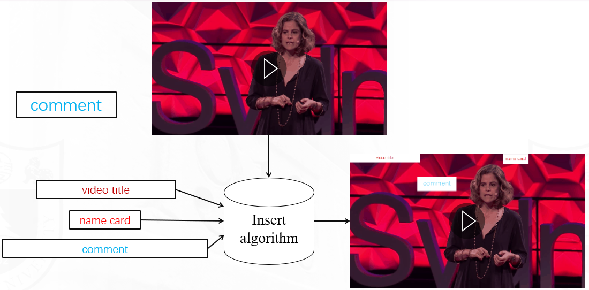
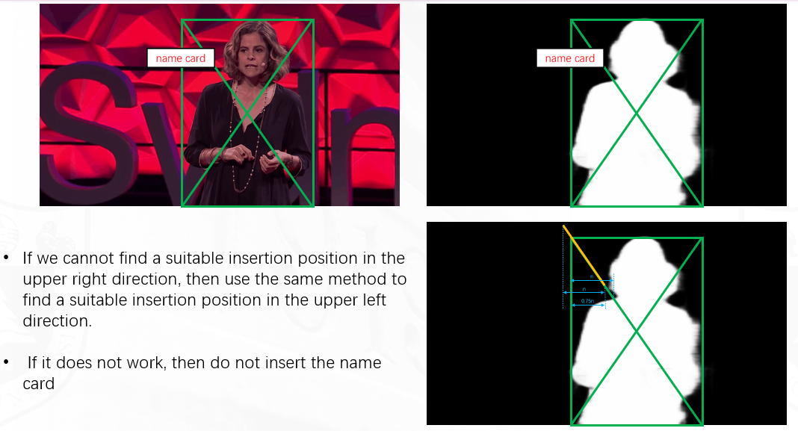

# VST in MSRA


More details please see [VST Github code](https://github.com/nnizhang/VST) and [VST paper](https://scholar.google.co.uk/scholar?hl=en&as_sdt=0%2C5&q=Visual+Saliency+Transformer&btnG=).








## Requirement

```sh
$ pip install -r /utils/requirements.txt
```

## VST for SOD

### Data Preparation for SOD

#### Training Set

We use the training set of [DUTS](http://saliencydetection.net/duts/) to train our VST for RGB SOD. Besides, we follow [Egnet](https://github.com/JXingZhao/EGNet) to generate contour maps of DUTS trainset for training. You can directly download the generated contour maps `DUTS-TR-Contour` from [[baidu pan](https://pan.baidu.com/s/17OnUi09YuOOq23xNrdYCLQ) fetch code: ow76 | [Google drive](https://drive.google.com/file/d/1NizY8WZSz-5i5KV7bATODi76fovrLuVf/view?usp=sharing)] and put it into `data` folder.

#### Testing Set

We use the testing set of [DUTS](http://saliencydetection.net/duts/), [ECSSD](http://www.cse.cuhk.edu.hk/leojia/projects/hsaliency/dataset.html), [HKU-IS](https://i.cs.hku.hk/~gbli/deep_saliency.html), [PASCAL-S](http://cbi.gatech.edu/salobj/), [DUT-O](http://saliencydetection.net/dut-omron/), and [SOD](http://elderlab.yorku.ca/SOD.) to test our VST. After Downloading, put them into `/data` folder.

Your `Data` folder should look like this:

```
-- Data
   |-- DUTS
   |   |-- DUTS-TR
   |   |-- | DUTS-TR-Image
   |   |-- | DUTS-TR-Mask
   |   |-- | DUTS-TR-Contour
   |   |-- DUTS-TE
   |   |-- | DUTS-TE-Image
   |   |-- | DUTS-TE-Mask
   |-- ECSSD
   |   |--images
   |   |--GT
   ...
```

### Training, Testing, and Evaluation

1. Download the pretrained T2T-ViT_t-14 model [[baidu pan](https://pan.baidu.com/s/1adESOUSpErZEceyLIoNOxQ) fetch code: 2u34 | [Google drive](https://drive.google.com/file/d/1R63FUPy0xSybULqpQK6_CTn3QgNog32h/view?usp=sharing)] and put it into `pretrained_model/` folder.
2. Run `python train_test_eval.py --Training True --Testing True --Evaluation True` for training, testing, and evaluation. The predictions will be in `preds/` folder and the evaluation results will be in `result.txt` file.

### Testing on Our Pretrained RGB VST Model

1. Download our pretrained `RGB_VST.pth`[[baidu pan](https://pan.baidu.com/s/1oVeMDmffc8M1RgRUbZEdpQ) fetch code: pe54 | [Google drive](https://drive.google.com/file/d/1tZ3tQkQ7jlDDfF-_ZROnEZg44MaNQFMc/view?usp=sharing)] and then put it in `checkpoint/` folder.
2. Run `python train_test_eval.py --Testing True --Evaluation True` for testing and evaluation. The predictions will be in `preds/` folder and the evaluation results will be in `result.txt` file.

Our saliency maps can be downloaded from [[baidu pan](https://pan.baidu.com/s/1CDkCjq9fRvOHLou9S9oGiA) fetch code: 92t0 | [Google drive](https://drive.google.com/file/d/1T4zDvBobQdT7L7i0HijOZSMfTS5hK-Ec/view?usp=sharing)].

## VST for SOD in MSRA

### Data Preparation for SOD in MSRA

Download our dataset [baidu pan](https://pan.baidu.com/s/16ji6NtkVpXP0nwHsMte-sQ?pwd=6666 ) and fetch code: 6666

And then put it in `data/` folder.

Your `/data` folder should look like this:

```
-- data
   |-- input
   |   |-- 1.gif
   |   |-- 2.gif
   |...
   |-- comment.png
   |-- name_card.png
   |-- video_title.png
```

### Testing

1. Download our pretrained `RGB_VST.pth`[[baidu pan](https://pan.baidu.com/s/1oVeMDmffc8M1RgRUbZEdpQ) fetch code: pe54 | [Google drive](https://drive.google.com/file/d/1tZ3tQkQ7jlDDfF-_ZROnEZg44MaNQFMc/view?usp=sharing)] and then put it in `checkpoint/` folder.
2. Run `Main.py` for testing 

More details please see [baidu pan](https://pan.baidu.com/s/14BWB2OYqsRxTJJ4h81u_gw?pwd=6666) fetch code: 6666.

## Results

### input


### SOD map


### output


## Acknowledgement

We thank the authors of [VST](https://github.com/nnizhang/VST) for providing codes of VST.

## Citation

If you think our work is helpful, please cite

```
@InProceedings{Liu_2021_ICCV,
    author    = {Liu, Nian and Zhang, Ni and Wan, Kaiyuan and Shao, Ling and Han, Junwei},
    title     = {Visual Saliency Transformer},
    booktitle = {Proceedings of the IEEE/CVF International Conference on Computer Vision (ICCV)},
    month     = {October},
    year      = {2021},
    pages     = {4722-4732}
}
```